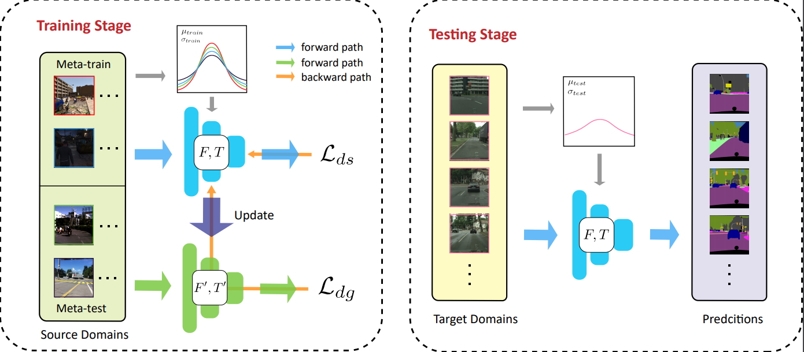

# TSMLDG
This is the source code of paper Generalizable Semantic Segmentation via Model-agnostic Learning and Target-specific Normalization).



## Environment

Pytorch 1.2.0,  GPU : 4 * V100, 

## DataSets

The training procedure needs [gta5(G)](https://download.visinf.tu-darmstadt.de/data/from_games/), [synthia_rand_citys(S)](https://synthia-dataset.net/downloads/), [idd(I)](https://idd.insaan.iiit.ac.in/), [mapillary(M)](https://www.mapillary.com/dataset/vistas?pKey=1GyeWFxH_NPIQwgl0onILw) and [cityscapes(C)](https://www.cityscapes-dataset.com/). Please download them and put to the same folder which can be specified in `paths.py`. The folder tree structure is as follows:
```
├── GTA5
│   ├── images
│   ├── labels
│   ├── mapping.mat
│   └── split.mat
├── IDD
│   ├── codes
│   ├── gtFine
│   └── leftImg8bit
├── SYNTHIA
│   └── RAND_CITYSCAPES
├── cityscapes
│   ├── gtFine
│   ├── leftImg8bit
│   ├── train_fine.txt
│   └── val_fine.txt
├── mapillary
│   ├── README
│   ├── config.json
│   ├── demo.py
│   ├── requirements.txt
│   ├── testing
│   ├── training
│   └── validation
```

We also generated some synthetic images with [CycleGAN](https://github.com/junyanz/CycleGAN), we download the `style_ukyoe.pth`, `style_vangogh.pth`, `style_cezanne.pth` pretrained models and transfered GTA5 dataset with these three pretrained models. The generated images are all put in the 'style_xxx' folder directly, which is the same as the `images` folder of GTA5.

## Train the model

The model can be trained with `train.py`. If we want to train the MLDG with four source domains(G, S, I, M) and one target domain(C), we can parse these arguments.
```
python train.py --name exp --source GSIM --target C --train-num 1  
```
For more details, please refer to `train.py`

## Test the model

The model can be trained with following command using `eval.py`. 
```
python eval.py --name exp --targets C --test-size 16
```

## Predict

```
python predict.py --name exp --targets C --test-size 16
```
